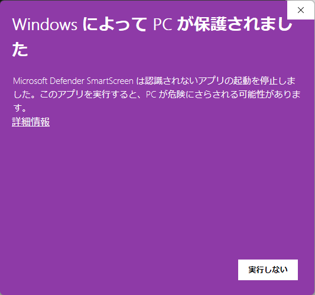
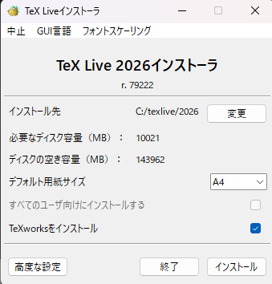
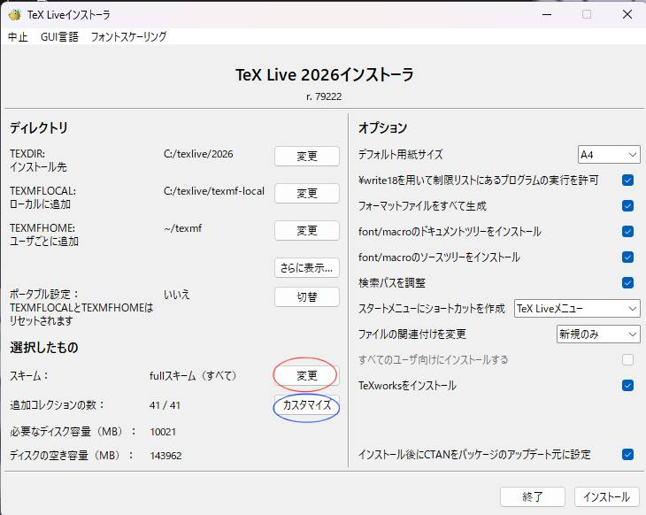
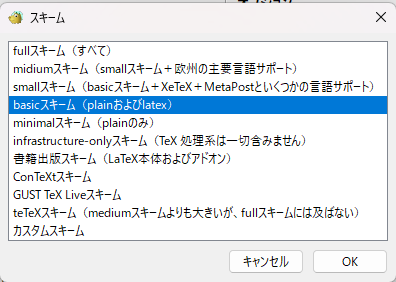
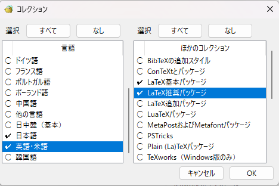
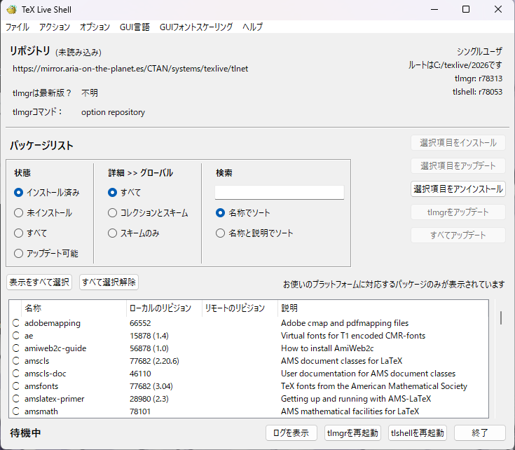
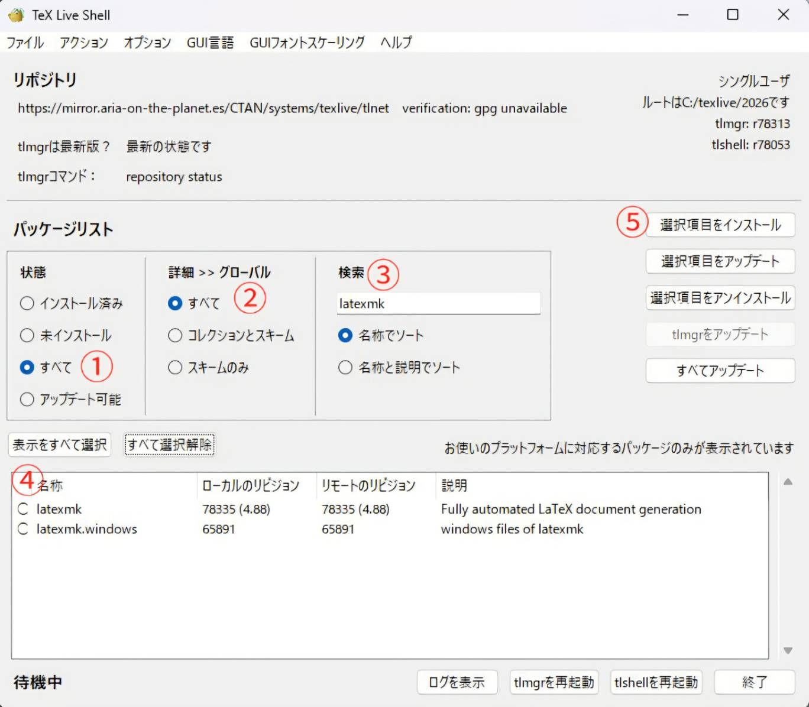

# VS Code での LaTeX 環境構築

## 経緯

目的: `LaTeX` を `VS Code` にて快適に運用する

実行環境：Windows 11

私の所属している研究室では，2週間に1回の個別ミーティングにおいて，[Overleaf](https://www.overleaf.com/)を用いた論文形式での進捗報告（`LaTeX` の記述）が要求されている．最初の2週間ほどは研究室の方針に従い，Overleaf上で直接記述していたが，研究を進める中で不便に感じる点が多く出てきた．

一番大きいストレスは，普段使い慣れている `VS Code` をエディタとして使用できない点だ．`VS Code` であれば豊富な拡張機能によって，コードの強力な自動補完，ファイルの自動保存，全角スペースの検知など，執筆を快適にする機能がすべて揃っている．
また，Overleafはビルド（PDF生成）を行うたびにプログラムやリソースを一度外部のサーバーにアップロードする仕様であるため，解像度の高い画像などの重い素材を挿入した際，ビルド完了までに長い待ち時間が発生し，研究の思考のテンポが削がれる大きなストレスとなった．

このような経緯から，日常的に `LaTeX` を使用して効率的に研究成果を蓄積していくのであれば，ローカルの `VS Code` 上で高速かつ快適に記述できる環境を構築するべきだと考えたのが，本環境整備のきっかけである．

---

## 1. TeX Live のインストール

### 1.1 実行ファイルのダウンロード

まず，パソコンに `TeX Live` という，`LaTeX` を動かすための基盤となるパッケージ一式をインストールする．

[Installing TeX Live over the Internet](https://www.tug.org/texlive/acquire-netinstall.html)から，Windows用のインストーラーである [install-tl-windows.exe](https://mirror.ctan.org/systems/texlive/tlnet/install-tl-windows.exe) をダウンロードする．

ダウンロード完了後にインストーラーを実行するが，Windowsのセキュリティ機能（SmartScreen）が働き，以下のような警告表示になることがある．



これが表示された場合，対象のソフトウェアが信頼できるものであるならば，「詳細情報」$\rightarrow$「実行」の順にクリックして進めてよい．今回の `TeX Live` は世界中で広く使われている学術ツールであるため問題はないが，一般のフリーソフト等のインストールでこの表示が出る場合は，安全性を一度検討するべきである．

### 1.2 インストール手順（最小構成への絞り込み）

インストーラーを実行すると「Install」ボタンが表示されるため，指示に従って進め，下のような詳細設定画面を開く．



この画面のまま初期設定で進めることも可能だが，全世界の全言語のパッケージをダウンロードするため，完了までに膨大な時間（数時間以上）がかかってしまう．そのため，「高度な設定（Advanced）」ボタンを押し，必要最小限の構成へ絞り込む設定を行う．



まず，画面内（上図の赤丸）の `変更` ボタンを押し，スキーム設定画面から**basicスキーム**を選択してOKを押す．



次に，（上図の青丸）の `カスタマイズ` ボタンを押し，左側の「言語」一覧から **日本語** と **英語・米語** だけを選択する．右側の「コレクション」一覧からは，**LaTeX基本パッケージ**，**LaTeX推奨パッケージ**，**Windows専用プログラム**，**必須プログラムとファイル** が選択されていることを確認し，OKを押す．



最初の `変更` ボタンでの設定が正常に反映されていれば，いくつかの項目は初めから最適化された状態になっている．この状態で `インストール` を開始する．これにより，インストール時間を大幅に短縮できる．

### 1.3 必須パッケージの個別導入

インストールが正常に終了したら，パッケージを管理するための以下のメイン画面が開く．



※自動で開かない場合は，Windowsのスタートメニューから `TLshell TeX Live Manager` を探して実行する．

まず，上部のメニューから「ファイル > リポジトリを読み込む」の順で選択する．出現したメニューに「読み込み完了」と表示されたら `閉じる` ボタンを押す．

次に，後述する `VS Code` での自動ビルド（全自動コンパイル）を制御するために不可欠なパッケージ群を個別に導入する．下の画像を参考に，以下の手順を実行する．



1. **状態** から「すべて」を選択する．
2. **詳細 >> グローバル** から「すべて」を選択する．
3. 検索窓に `latexmk` および `lualatex-math` と入力する．
4. 目的のパッケージ（`latexmk`，`latexmk.windows`，`lualatex-math`）のチェックボックスにチェックを入れる．
5. `選択項目をインストール` をクリックして実行する．

> **💡 インストールするパッケージの役割**
> - **`latexmk` / `latexmk.windows`**：複雑な `LaTeX` のコンパイル（文献引用や目次作成のための複数回の実行プロセス）を，ボタン一発で全自動化してくれる非常に強力な仲介スクリプト．
> - **`lualatex-math`**：数式環境におけるフォントや表現の不整合を修正し，数式のレンダリング精度を向上させるパッケージ．

3つのパッケージのインストールが完了し，ローカルのリビジョン欄に数字が表示されたことを確認したら，`終了` ボタンを押して `TLshell` を閉じる．

これでパソコン側の `LaTeX` 自体の初期設定（バックエンドの構築）がすべて完了した．次の項では，これらを `VS Code` と連携させ，執筆を自動化するための具体的なエディタ設定について述べる．

## 2. VS Code 側の環境構築と設定

`LaTeX` の基盤が整ったら，次は `VS Code` に必要な機能を組み込み，全自動でコンパイルが回るシステムを構築する．

### 2.1 必要な拡張機能の導入
VS Codeの拡張機能マーケットプレイス（ `Ctrl + Shift + X` ）から，以下の2つの拡張機能をインストールする．

1. [LaTeX Workshop](https://marketplace.visualstudio.com/items?itemName=James-Yu.latex-workshop) （必須：コンパイル・PDF閲覧のコアエンジン）
2. [LaTeX Utilities](https://marketplace.visualstudio.com/items?itemName=tecosaur.latex-utilities) （推奨：執筆効率化のためのサポーター）

---

### 2.2 実行ファイルのパス確認と絶対パス指定のメリット

一般的な解説サイトでは，設定ファイルに単に `"command": "latexmk"` のようにコマンド名だけを書く手順が紹介されています．これは Windows の「環境変数（PATH）」に依存した設定方法です．

しかし，Windows の環境変数による紐付けは，PC環境の差異によって「PATHは通っているはずなのに VS Code からうまく叩けない」という原因不明のエラーを引き起こすケースが多々あります．

そこで本環境構築では，環境変数の安否をわざわざ確認する手間を省き，**「実行ファイルのフルパスを直接エディタに叩き込んで強制的に認識させる」**という，環境に依存しない絶対安定アプローチを採用します．

#### 【確認ステップ】
設定を書き換える前に，エクスプローラーを開き，以下のフォルダの場所に実行ファイルが確かに存在するかだけを確認してください．
> `C:\texlive\2026\bin\windows\`

このフォルダの中に，**`latexmk.exe`**，**`uplatex.exe`**，**`dvipdfmx.exe`** が存在していれば準備完了です．
（※もしインストールした時期によってフォルダの `2026` という数値が異なる場合は，適宜自分のフォルダ名に読み替えて，次の `settings.json` の該当部分を書き換えてください）．

---

### 2.3 settings.json の構成

VS Codeのユーザー設定（ `Ctrl + ,` から画面右上の「設定(JSON)を開く」アイコンをクリック ）に，以下のコードを記述する．
すでに他の設定が記述されている場合は，末尾の `{}` の内側に必要な部分を追記してください．

<details>
<summary>ここをクリックして完全な settings.json のコードを展開</summary>

```json
{
    // ====== 【共通設定】個人の好みや他言語の設定（必要に応じて調整） ======
    "workbench.colorTheme": "Default High Contrast",
    "editor.defaultFormatter": "bmewburn.vscode-intelephense-client",
    "php.validate.enable": false,
    "php.suggest.basic": false,
    "editor.formatOnSave": true,
    "workbench.editorAssociations": {
        "*.crdownload": "default"
    },
    "phpserver.phpPath": "C:\\xampp\\php\\php.exe",
    "[jsonc]": {
        "editor.defaultFormatter": "vscode.json-language-features"
    },
    "vscode-edge-devtools.webhint": false,
    "terminal.integrated.allowedLinkSchemes": [
        "file", "http", "https", "mailto", "vscode", "vscode-insiders", "ms-settings"
    ],
    "chat.viewSessions.orientation": "stacked",
    "remote.SSH.remotePlatform": {
        "ubuntu33": "linux"
    },
    "files.autoSave": "afterDelay",
    "code-runner.saveFileBeforeRun": true,
    "code-runner.saveAllFilesBeforeRun": true,
    "github.copilot.nextEditSuggestions.eagerness": "low",

    // ====== 【最重要】Markdown環境における自動括弧・タグ補完の強制有効化 ======
    "editor.autoClosingBrackets": "always",
    "editor.autoClosingQuotes": "always",

    // ====== 【最重要】LaTeX Workshop 絶対安定・完全同期システム ======
    "latex-workshop.latex.tools": [
        {
            "name": "latexmk",
            "command": "C:/texlive/2026/bin/windows/latexmk.exe", // ⭕️ 環境変数に依存しない絶対パス指定
            "args": [
                "-gg",
                "-cd",
                "-pdfdvi",
                "-latex=uplatex %O %S", // ⭕️ 日本語論文・報告書を完璧に処理するupLaTeX指定
                "-outdir=%OUTDIR%",
                "-synctex=1", // ⭕️ PDFとコードの正確な位置同期（SyncTeX）を有効化
                "-interaction=nonstopmode",
                "-file-line-error",
                "%DOC%"
            ]
        },
        {
            "name": "uplatex",
            "command": "C:/texlive/2026/bin/windows/uplatex.exe",
            "args": [
                "-synctex=1",
                "-interaction=nonstopmode",
                "-file-line-error",
                "-output-directory=%OUTDIR%",
                "%DOC%"
            ]
        },
        {
            "name": "dvipdfmx",
            "command": "C:/texlive/2026/bin/windows/dvipdfmx.exe",
            "args": [
                "-o",
                "%OUTDIR%/%DOCFILE%.pdf",
                "%OUTDIR%/%DOCFILE%.dvi"
            ]
        }
    ],
    "latex-workshop.latex.recipes": [
        {
            "name": "latexmk (reference + SyncTeX)", // ⭕️ 普段使い用の全自動周回ビルドレシピ
            "tools": [
                "latexmk"
            ]
        },
        {
            "name": "uplatex -> dvipdfmx", // ⚠️ 万が一latexmkがバグを起こした際の手動直線ビルド
            "tools": [
                "uplatex",
                "dvipdfmx"
            ]
        }
    ],
    "latex-workshop.latex.autoBuild.run": "onSave", // ⭕️ ファイル保存（Ctrl+S）時に自動でPDFを最新化
    "latex-workshop.view.pdf.viewer": "tab",        // ⭕️ VS Codeのタブ内部でPDFをプレビュー
    "latex-workshop.latex.outDir": "out",           // ⭕️ ログや中間ファイルを「out」フォルダへ隔離
    "latex-workshop.latex.recipe.default": "latexmk (reference + SyncTeX)",
    "latex-workshop.view.pdf.internal.synctex.keybinding": "double-click", // ⭕️ PDF側をダブルクリックするとコードの該当行へジャンプ
    "editor.hover.enabled": "on",
    "editor.hover.delay": 300,
    "latex-workshop.editor.autoClosingBrackets.enabled": true,
    "latex-workshop.latex.hover.preview.enabled": true,
    "latex-workshop.hover.preview.trigger.modifiers": [],
    "latex-workshop.latex.rootFile.indicator": "\\begin{document}",
    "latex-workshop.latex.rootFile.useMagicComments": true,
    "latex-workshop.view.pdf.color.light.backgroundColor": "#ffffff",
    "latex-workshop.view.pdf.color.dark.backgroundColor": "#1e1e1e",
    "cSpell.enabledFileTypes": {
        "latex": false,
        "tex": false
    },
    "cSpell.dictionaries": [
        "companies",
        "softwareTerms",
        "misc"
    ]
}
```

</details>


## 3. プロジェクト（ワークスペース）限定設定の構築

前項ではPC全体に適用される「ユーザー設定」について解説しましたが，実際の共同研究やGitを用いたリポジトリ管理においては，**「その研究プロジェクトのフォルダを開いているときだけ，特別な設定を強制発動させる」**という手法（ワークスペース設定）が極めて有効です．

特に `LaTeX` の環境構築では，個人のPC環境に依存するバグや，他の言語（PHPやPythonなど）の拡張機能とのキーバインド競合を完全に遮断する必要があるため，プロジェクトのルートに専用の設定ファイルを配置します．

### 3.1 設定ファイルの作成手順

1. `VS Code` で現在作業している研究プロジェクトのルート（一番上の階層）に，新規フォルダ **`.vscode`** を作成する．（※必ず先頭にドットを付けてください）．
2. 作成した `.vscode` フォルダの直下に，新規ファイル **`settings.json`** を作成する．
3. 作成したファイルに，以下のコードをそのままコピー＆ペーストして保存（ `Ctrl + S` ）する．

<details>
  <summary>ここをクリックしてプロジェクト用 settings.json のコードを展開</summary>

  ```json
{
    // ====== LaTeX Workshop ビルドツール（コマンドのフルパス直接指定） ======
    "latex-workshop.latex.tools": [
        {
            "name": "latexmk (upLaTeX)",
            "command": "C:/texlive/2026/bin/windows/latexmk.exe",
            "args": [
                "-gg",
                "-cd",
                "-pdfdvi",
                "-latex=uplatex %O %S", // ⭕️ 日本語論文・報告書を文字化けなく完璧に処理
                "-outdir=%OUTDIR%",
                "-synctex=1",
                "-interaction=nonstopmode",
                "-file-line-error",
                "%DOC%"
            ]
        },
        {
            "name": "uplatex",
            "command": "C:/texlive/2026/bin/windows/uplatex.exe",
            "args": [
                "-synctex=1",
                "-interaction=nonstopmode",
                "-file-line-error",
                "-output-directory=%OUTDIR%",
                "%DOC%"
            ]
        },
        {
            "name": "dvipdfmx",
            "command": "C:/texlive/2026/bin/windows/dvipdfmx.exe",
            "args": [
                "-g",
                "-o",
                "\"%OUTDIR%/%DOCFILE%.pdf\"", // ⭕️ パス内のアンダーバー（_）によるパースエラーを物理的に保護
                "\"%OUTDIR%/%DOCFILE%.dvi\"" // ⭕️ パス内のアンダーバー（_）によるパースエラーを物理的に保護
            ]
        }
    ],

    // ====== レシピ（コンパイル手順の組み合わせ）の定義 ======
    "latex-workshop.latex.recipes": [
        {
            "name": "latexmk (Reference自動判別・普段使い用)",
            "tools": [
                "latexmk (upLaTeX)"
            ]
        },
        {
            "name": "uplatex -> dvipdfmx (万が一のときの手動直線ビルド)",
            "tools": [
                "uplatex",
                "dvipdfmx"
            ]
        }
    ],

    // ====== コンパイル挙動・エディタ表示の最適化コア設定 ======
    "latex-workshop.latex.recipe.default": "first", // ⭕️ 常に一番上の全自動レシピ（latexmk）を優先起動
    "latex-workshop.latex.outDir": "out",           // ⭕️ ログや中間ファイルを「out」フォルダへ隔離してクリーンに維持
    "latex-workshop.latex.autoBuild.run": "onSave", // ⭕️ ファイル保存（Ctrl+S）時に全自動で裏でコンパイルを回す
    "latex-utilities.countWord.format": "",

    // ====== 文字折り返しおよび文字コードの厳密化 ======
    "[latex]": {
        "editor.wordWrap": "on" // ⭕️ 論文の長い文章が画面外にはみ出さず自動で改行されるようにする
    },
    "files.encoding": "utf8", // ⭕️ 異なるプラットフォーム間での文字化けを完全に防止

    // ====== 全角スペースや特殊文字の強調表示をMarkdown側と競合させないための防御設定 ======
    "editor.unicodeHighlight.ambiguousCharacters": false,
    "editor.unicodeHighlight.invisibleCharacters": false
}
```

</details>

## 4. LaTeX のビルド（PDF出力）とプレビュー手順

環境構築の最終ステップとして，実際に `.tex` ファイルからPDFを出力し，画面上に表示させるための具体的な操作手順を解説します．

### 4.1 全自動ビルド（PDF生成）の実行

`VS Code` でのビルド方法は極めてシンプルです．基本的には以下のいずれかの操作を行うだけで，裏側で全自動でコンパイルが走り，最新のPDFが生成されます．

* **方法A（推奨）：ショートカットキーでの実行**
  編集中の `.tex` ファイル（例： `main.tex` ）の画面で，キーボードの **`Ctrl + S`**（ファイル保存）を押す．（前項の設定により，保存と同時に自動ビルドが発動します）．
* **方法B：メニュー画面からの実行**
  1. `VS Code` の左側メニューバーにある **「TEXアイコン（アクティビティバー）」** をクリックする．
  2. 開いたメニュー内の「Build LaTeX project」項目を展開し，一番上にある **`Recipe: latexmk (Reference自動判別・普段使い用)`** をクリックして選択する．

正常にビルドが完了すると，プロジェクトフォルダ内に自動生成された **`out`** という名前のフォルダの中に，完成した `.pdf` ファイルが格納されます．

---

### ⚠️ 【重要】初コンパイル時にエラーが出た場合のトラブルシュート

環境によっては，最初の保存（ `Ctrl + S` ）をした際に，画面右下に「Recipe termination error」などの赤文字のコンパイルエラーが表示される場合があります．

#### 原因
前項の設定により，ビルド時のゴミファイルを綺麗に隠すため，出力先を `out` フォルダ（ `"latex-workshop.latex.outDir": "out"` ）に指定しています．しかし，**「まだプロジェクト内に一度も `out` という名前のフォルダが存在していない」** ことが原因で，ファイルを書き込めずにシステムが迷子になり，フリーズしてしまうバグが Windows 環境で稀に発生します．

#### 解決策（手動でのフォルダ作成）
1. `VS Code` のエクスプローラー（ファイル一覧画面）を開く．
2. プロジェクトのルート（ `main.tex` と同じ階層 ）に，右クリックから新規フォルダを作成し，名前を **`out`** とする．
3. `out` フォルダが存在する状態で，もう一度 `main.tex` の画面に戻り， `Ctrl + S` を押す．

一度手動で `out` フォルダを作ってしまえば，次からはエラーが起きず，100%確実にPDFが更新されるようになります．

---

### 4.2 PDFプレビューの表示（画面分割システム）

生成されたPDFを，使い慣れたブラウザ（Chromeなど）や外部のPDFビューアでわざわざ開く必要はありません． `VS Code` の内部タブとして，コードのすぐ右側に美しいプレビュー画面を配置できます．

#### 起動手順
1. 編集中の `.tex` ファイルを開いた状態にする．
2. エディタ画面の右上（下図の赤丸で示した位置）にある **「虫眼鏡マーク（View LaTeX PDF）」** のアイコンをクリック，またはCtrl+Art+Vを実行する．


3. アイコンをクリックすると，エディタが自動的に左右に画面分割され，右側のタブに最新のPDFがシュッと表示されます．

#### 💡 完全同期（SyncTeX機能）の体験
この表示方法の最大の強みは，前項で設定した **「SyncTeX（シンクテックス）」** が完全に連動する点です．

* **PDFからコードへのジャンプ**：
  右側のプレビューPDF内で「修正したい一文や数式」を見つけたら，その場所を **ダブルクリック** する．すると，左側のエディタ内の該当するコードの行へカーソルが自動的にジャンプします．

何十ページにも及ぶ巨大な進捗報告書や卒業論文を執筆する際，目的の文章を探す手間が完全にゼロになるため，研究の作業効率が劇的に跳ね上がります．

---

## 5. 研究室指定パッケージの追加と配置（エラー対策）

環境構築が完了し，ビルドしようとした際，画面に `LaTeX Error: File 'svn-prov.sty' not found.` などのエラーが表示されてコンパイルが止まることがあります．

これは，前述の「basicスキーム（最小構成）」によるインストールの影響で，一部の特殊なスタイルファイル（ `.sty` ）がパソコン内に足りていないために発生します．完全に動作させるため，以下の [svn-prov.sty](https://github.com/MartinScharrer/svn-prov/blob/main/svn-prov.sty) と [xurl.sty](https://ctan.org/tex-archive/macros/latex/contrib/xurl/latex) の2つのパッケージを手動で導入します．

### 5.1 スタイルファイルの入手と配置手順

最も確実かつリポジトリを汚さない方法は，**「現在編集している `main.tex` と全く同じ階層（カレントディレクトリ）にスタイルファイルを直接置く」** というアプローチです．

#### 【配置ステップ】
1. [svn-prov.sty](https://github.com/MartinScharrer/svn-prov/blob/main/svn-prov.sty) 及び [xurl.sty](https://ctan.org/tex-archive/macros/latex/contrib/xurl/latex) をダウンロードする．
2. `VS Code` で開いている研究プロジェクトのルート（ `main.tex` が置いてあるフォルダの直下 ）に，これらのファイルをそのまま貼り付ける．

```text
📁 research_preparation (プロジェクトのルート)
   ├── 📁 .vscode
   ├── 📁 out
   ├── 📄 main.tex
   ├── 📄 svn-prov.sty  <-- ⭕️ ここに直接配置する
   └── 📄 xurl.sty      <-- ⭕️ ここに直接配置する
```

---

## 6. よくあるコマンド（参考）

- ローカルで手動ビルド:

```bash
latexmk -pdf template.tex
```

- 一時ファイルの削除:

```bash
latexmk -c
```

- ビルドがフリーズした際の強制終了（Windows用プロセス削除）:

VS Code上でビルドが途中で止まったり，PDFファイルがロックされて書き込めなくなったりした際，裏で残り続けている LaTeX 関連のプロセスをターミナル（PowerShell）から一発で強制終了させます．

```PowerShell
Stop-Process -Name "latexmk", "uplatex", "dvipdfmx" -Force
```

(※エラーメッセージが出てボタンが効かなくなった場合，これをターミナルに貼り付けてEnterを押すだけで，VS Codeを再起動することなくクリーンな状態にリセットできます)

- 手動での完全クリーン（中間ファイルの物理削除）:

latexmk -c では消しきれない，より深い一時ファイル（ .synctex.gz や .fls などの同期用データ ）も含めて， out フォルダの中身を完全に初期化して真っさらにします．

```Bash
latexmk -C
```

(※小文字の -c はログや補助ファイルのみを消しますが，大文字の -C は生成されたPDFも含めてすべてを一度完全に消去し，次回のビルドを完全な「一発目のクリーンビルド」にすることができます)


---

>参考：[spacedesk の使い方](https://freesoft-100.com/review/spacedesk.html)、[TeXをVS Codeでとりあえず使えるようにする](https://note.com/ou_n__au_n/n/n376062529c90)，[[初心者]LaTeXのインストールから使い方までこれ一本！](https://qiita.com/alpaca-honke/items/f30a2d04eedaa3c36a21)
