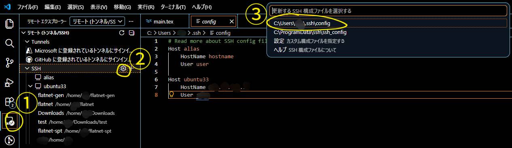
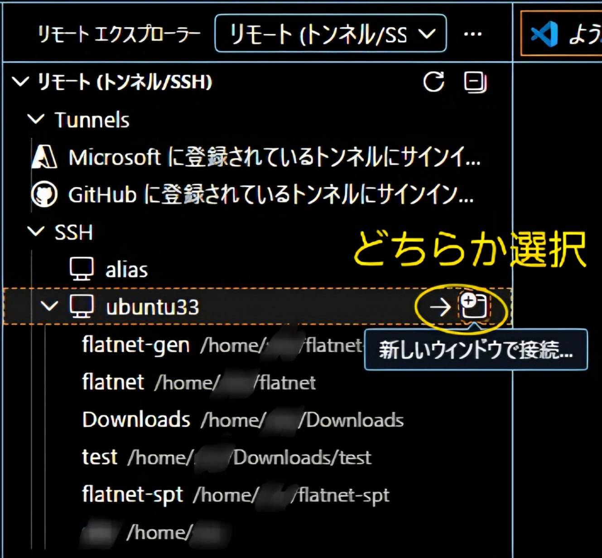
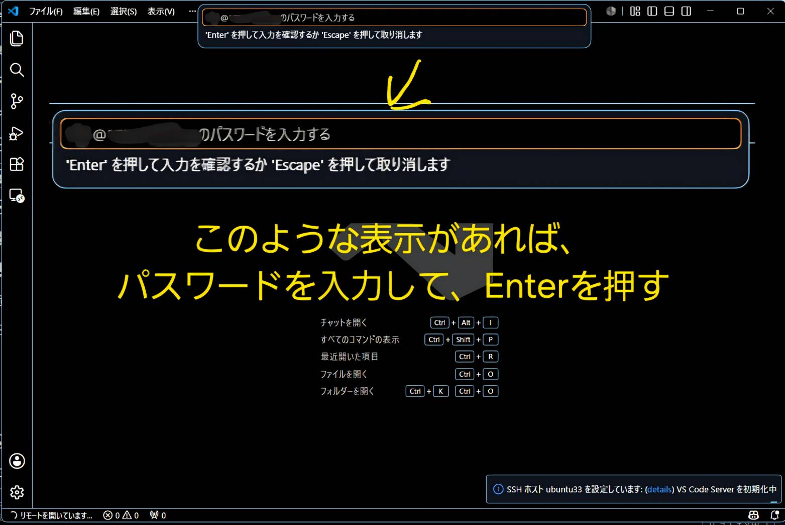
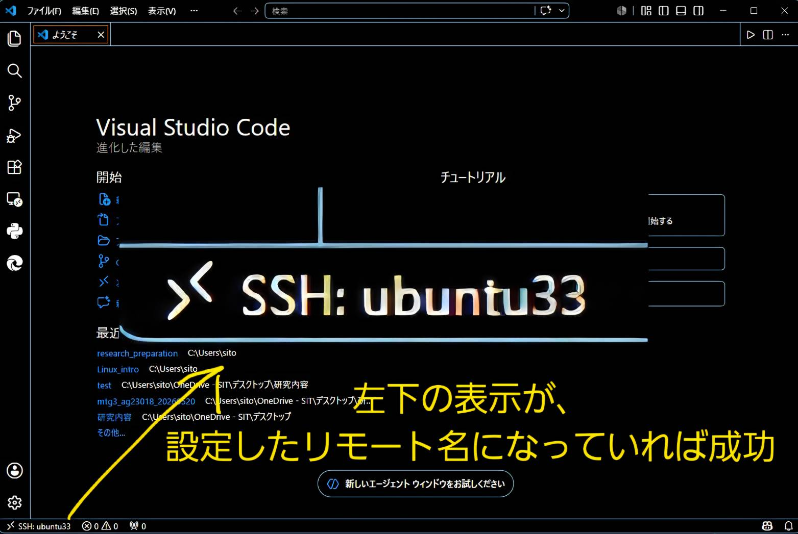

# Remote-SSH 環境設定

この手順は、VS Code からリモート Linux サーバーへ SSH 接続するためのものです。

## ゴール

- VS Code からサーバーへ接続できる
- サーバー上のフォルダを開いて編集・実行できる

## 必要な拡張機能

- [Remote - SSH](https://marketplace.visualstudio.com/items?itemName=ms-vscode-remote.remote-ssh)

## 事前に準備する情報

- サーバーの IP アドレスまたはホスト名
- ログインユーザー名
- 認証情報（パスワード、または秘密鍵）

## 接続設定

1. VS Code 左側のリモートエクスプローラーを開きます。
2. SSH の歯車アイコンから SSH 設定ファイルを開きます。
3. `C:/Users/<Windowsユーザー名>/.ssh/config` を選択します。



4. 次の内容を追記して保存します。

```sshconfig
Host lab-server
    HostName your_ip_address
    User your_user
```

公開鍵認証を使う場合は `IdentityFile` も追加します。

```sshconfig
Host lab-server
    HostName your_ip_address
    User your_user
    IdentityFile C:/Users/<Windowsユーザー名>/.ssh/id_ed25519
```

## 接続手順

1. リモートエクスプローラーに表示された `lab-server` を選択します。
2. 現在のウィンドウで開くか、新しいウィンドウで開くかを選びます。
3. 初回はホスト鍵確認が出る場合があるため、内容を確認して許可します。


4. パスワード認証の場合は、入力欄にパスワードを入力します。



接続成功後、左下に `SSH: lab-server` のように表示されます。


## うまくいかないとき

- 接続先が表示されない: `config` ファイルの保存先が正しいか確認
- 認証に失敗する: ユーザー名・パスワード・鍵パスの入力ミスを確認
- 止まって見える: 上部入力欄にパスワード待ちが出ていないか確認
- 原因不明: `View -> Output -> Remote - SSH` のログを確認

## 完了チェック

- 左下に `SSH: <Host名>` が表示される
- サーバー上フォルダを開ける
- 統合ターミナルで `hostname` がリモート先を示す

> 参考：[【開発Tips】VS-Code + RemoteSSHでリモート接続する方法](https://www.youtube.com/watch?v=gAPVndaxH7g)
