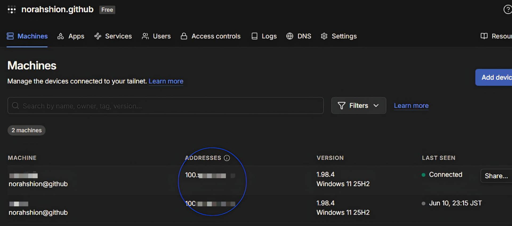
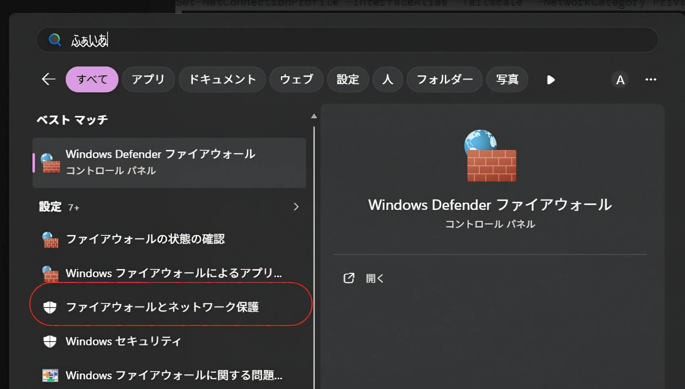
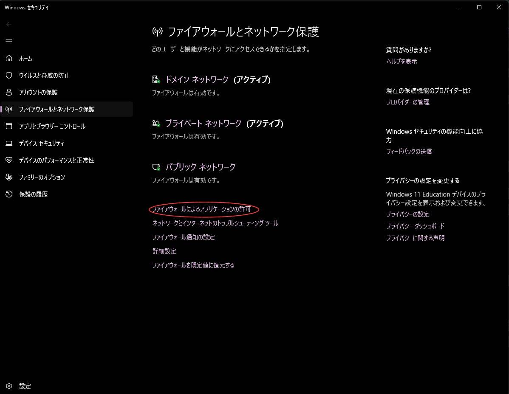
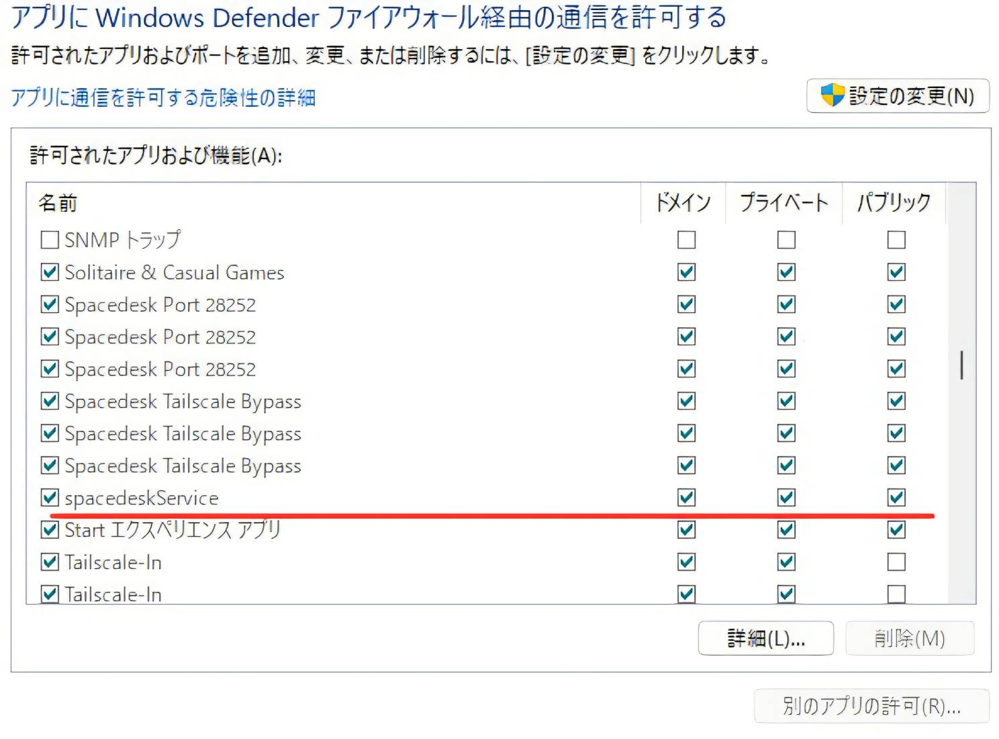

# 【備忘録】学内ネットワーク環境におけるspacedesk + Tailscaleを用いた画面拡張手順

大学の学内LAN（有線）と学内Wi-Fiのように、ネットワークセグメントが分離しており通常のMiracastやspacedeskが利用できない環境において、仮想VPN（Tailscale）を構築してノートPCをサブディスプレイ化する手順。

---

## 1. 使用するソフトウェアのインストール

### ホスト側（画面を提供する研究室のデスクトップPC）
* [spacedesk Driver (SERVER)](https://www.spacedesk.net/download/#server-driver) をインストール
* [Tailscale](https://tailscale.com/download) をインストール

### クライアント側（モニターとして使う自分のノートPC）
* **spacedesk Viewer (CLIENT)** をインストール
  * 公式：https://www.spacedesk.net/download/#client-driver
* **Tailscale** をインストール

---

## 2. ネットワーク（VPN）の構築と確認

1. 両方のPCで **Tailscale** を起動し、**同じアカウント**でログインする。
2. 接続が完了したら、ホスト側（研究室PC）に割り当てられた Tailscale専用のIPアドレス（`100.xxx.xxx.xxx`）を確認し、控える。

3. クライアント側（ノートPC）でコマンドプロンプトまたはPowerShellを開き、疎通確認を行う。


```bash
ping [ホスト側のTailscale IPアドレス]
```

4. 損失0%で応答（Reply）が返ってくることを確認する。

## 3. ホスト側のセキュリティ設定（Windowsファイアウォール解放）

学内ネットワークの厳しい制限やWindowsのブロックを回避するため、ホスト側（研究室PC）で以下の設定を強制適用する。

① GUIでの基本確認
スタートから，「ファイアウォールとネットワーク保護」を実行


ファイアウォールによるアプリケーションの許可を選択


「spacedesk Windows Desktop Service」 の「プライベート」と「パブリック」の両方にチェックが入っているか確認


② PowerShellコマンドによる強制解放
ホスト側（研究室PC）のスタートボタンを右クリックし、「ターミナル（管理者）」 または 「PowerShell（管理者）」 を起動し、以下の3つのコマンドを順に実行する。

PowerShell
### 1. Tailscaleネットワークを「プライベート」に強制変更し、セキュリティを緩和する

```PowerShell
Set-NetConnectionProfile -InterfaceAlias "Tailscale" -NetworkCategory Private
```

### 2. spacedeskのプログラムの通信をファイアウォールで強制許可する

```PowerShell
New-NetFirewallRule -DisplayName "Spacedesk Tailscale Bypass" -Direction Inbound -Program "C:\Program Files\datronicsoft\spacedesk\spacedeskService.exe" -Action Allow
```

### 3. spacedeskが使用する通信ポート（28252）を強制解放する

```PowerShell
New-NetFirewallRule -DisplayName "Spacedesk Port 28252" -Direction Inbound -Protocol TCP -LocalPort 28252 -Action Allow
```

## 4. 接続と画面の調整

ホスト側（研究室PC）で spacedesk SERVER アプリを開き、ステータスが spacedesk Status: ON (Clear) （緑色）になっていることを確認。

クライアント側（ノートPC）で spacedesk Viewer アプリを開く。

アプリ内の「＋ (Add)」ボタンを押し、控えておいたホスト側の Tailscale IPアドレス（100.xxx.xxx.xxx） を入力して追加する。

追加されたサーバーを選択すると、画面拡張が開始される。

## 5. 仕上げ（文字サイズが小さい場合の対処法）
ノートPC側のアイコンや文字が小さくて見づらい場合は、ホスト側（研究室PC）のWindows設定から調整する。

デスクトップ右クリック ➔ 「ディスプレイ設定」

ディスプレイの配置図から ノートPC側の画面（通常は「2」など）を選択

「拡大縮小とレイアウト」の項目を 125% または 150% に変更する。

>参考：[spacedesk の使い方](https://freesoft-100.com/review/spacedesk.html)，[iPadをWindowsのサブディスプレイにする方法【spacedesk】](https://note.com/okumura_ab/n/n4c00da85039e)